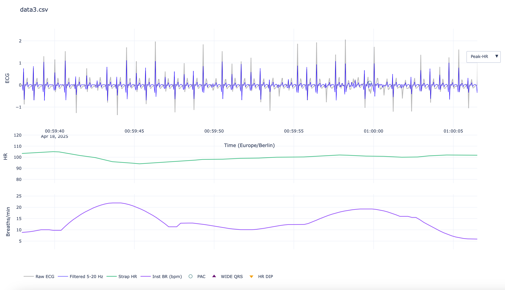

# polarecgvis

Visualise ECG, Heart Rate and extrapolated Breathing Rate from Polar H10 chest straps!

*NOTE: THESE METRICS AND INTERPRETATIONS ARE PURELY FOR ENTERTAINMENT PURPOSES AND NOT FOR ANY CLINICAL OR DIAGNOSTIC PURPOSES. IN SHORT: The data is ABSOLUTELY NOT suitable for ANY pseudomedical purposes!!! *



## Overview

PolarECGVis is a Python-based tool for visualizing and analyzing ECG data collected from Polar H10 chest straps. The project provides tools for processing raw ECG data, detecting heart rate, extrapolating breathing rate, and identifying potential cardiac arrhythmias.


## Features

- **Interactive ECG Visualization**: View raw and filtered ECG signals
- **Heart Rate Tracking**: Calculate and visualize instantaneous heart rate from RR intervals
- **Breathing Rate Estimation**: Novel approach to extract breathing rate from heart rate variability
- **Arrhythmia Detection**: Identification of potential:
  - Premature Ventricular Contractions (PVCs)
  - Premature Atrial Contractions (PACs)
  - Wide QRS complexes
  - Heart rate dips
- **Interactive Web Interface**: Results displayed in browser-based interactive plots

## Installation

```bash
# Install the required packages
pip install -r requirements.txt

# Or using uv (as used by the project)
uv pip install -r requirements.txt
```

## Requirements

- Python 3.12+
- Dependencies:
  - numpy
  - pandas
  - scipy
  - plotly
  - pytz
  - matplotlib (for h10_analyser.py)

## Usage

### h10_viewer.py

```bash
python h10_viewer.py path/to/ecg/file.csv [options]
```

Options:
- `--down INT`: Downsample factor for visualization (default: 5)
- `--out FILE`: Output HTML file name (default: "ecg_view.html")
- `--open`: Automatically open the generated HTML in a browser

### h10_analyser.py

```bash
python h10_analyser.py path/to/ecg/file.csv [options]
```

Options:
- `--plot`: Display plot of heart rate
- `--outdir DIR`: Output directory for results (default: current directory)
- `--brady-drop FLOAT`: BPM threshold for bradycardia/HR dip detection (default: 30)
- `--qrs-wide FLOAT`: Threshold for wide QRS detection in ms (default: 120)

## How h10_viewer.py Works

The heart of the polarecgvis project is `h10_viewer.py`, which performs several key functions:

### 1. Data Loading and Processing

- **CSV Parsing**: Reads ECG data from CSV files with 2-4 columns (timestamps, ECG values, HR, RR)
- **Sample Rate Detection**: Uses mode of time differences to robustly estimate sampling frequency
- **Signal Filtering**: Applies bandpass filtering (5-20 Hz) to isolate QRS complexes
- **Peak Detection**: Identifies R-peaks using adaptive thresholding and minimum distance constraints

### 2. Heart Rate and RR Interval Analysis

- **RR Interval Calculation**: Measures time between consecutive R-peaks
- **Instantaneous Heart Rate**: Calculates beat-to-beat heart rate (60/RR)
- **Smoothing**: Applies rolling median filters to reduce noise
- **HR Dip Detection**: Identifies significant drops in heart rate compared to baseline

### 3. Breathing Rate Estimation

The breathing rate estimation leverages a phenomenon called respiratory sinus arrhythmia (RSA), where heart rate naturally varies with the respiratory cycle. This technique extracts breathing rate without direct respiratory measurements:

1. **Physiological Basis**:
   - During inhalation, heart rate slightly increases
   - During exhalation, heart rate slightly decreases
   - These cyclical variations in heart rate (RR intervals) contain information about breathing frequency

2. **RR Interval Preprocessing**:
   - Filters out invalid/missing values from RR interval series
   - Creates unique time points to handle duplicate timestamps
   - Resamples RR intervals to a uniform 4 Hz time series using linear interpolation
   
3. **Respiratory Band Isolation**:
   - Applies detrending to remove slow drift in RR intervals
   - Uses a bandpass filter (0.15-0.40 Hz) to isolate frequencies corresponding to normal breathing range (9-24 breaths/minute)
   - Implements a sliding window approach (10-second windows with 80% overlap) to assess signal quality
   - Masks low-quality segments where respiratory sinus arrhythmia power is too low relative to total RR variability
   
4. **Hilbert Transform Analysis**:
   - Applies Hilbert transform to convert the filtered RR signal into an analytic signal
   - Extracts the instantaneous phase of this analytic signal using the `np.angle()` function
   - Unwraps the phase to prevent discontinuities
   - Smooths the unwrapped phase using a Savitzky-Golay filter (adaptive polynomial fitting)
   
5. **Frequency Calculation**:
   - Calculates instantaneous frequency by taking the derivative of the smoothed phase
   - Converts from radians/sample to Hz by dividing by 2π and multiplying by sampling rate
   - Clips values to physiologically plausible breathing frequencies (0-0.7 Hz)
   - Converts to breaths per minute (multiplying by 60)
   
6. **Post-processing**:
   - Applies rolling median filter to smooth the breathing rate estimate
   - Marks low-quality segments as NaN
   - Forward-fills short gaps to produce a continuous breathing rate signal

This algorithm represents a sophisticated application of signal processing to derive respiratory information from cardiac data, without requiring additional sensors.

### 4. Understanding Cardiac Terms and Detection Methods

#### What are these cardiac events?

1. **QRS Complex**:
   - The QRS complex represents ventricular depolarization in an ECG
   - Normal QRS duration is typically 80-120 ms
   - QRS width is measured from the beginning of the Q wave to the end of the S wave

2. **Premature Ventricular Contraction (PVC)**:
   - Early heartbeat originating from the ventricles (not the normal pacemaker)
   - Characteristic features:
     - Premature (occurs earlier than expected)
     - Wide QRS complex (>120 ms) due to abnormal conduction
     - Different morphology (shape) compared to normal beats
     - Often followed by a compensatory pause
     - Usually lacks a preceding P-wave

3. **Premature Atrial Contraction (PAC)**:
   - Early heartbeat originating from the atria outside the normal pacemaker
   - Characteristic features:
     - Premature (occurs earlier than expected)
     - Normal QRS width and morphology
     - Often has a visible but abnormal P-wave
     - Usually no compensatory pause
   
4. **Wide QRS Complex**:
   - Any beat with prolonged ventricular depolarization
   - Could be due to bundle branch block, ventricular origin, or aberrant conduction
   - Defined as QRS duration >120-130 ms

#### How the algorithm detects these events

1. **QRS Width Measurement**:
   ```python
   def qrs_width(ecg_f, r_idx, fs, frac=0.5, max_ms=200):
       # Calculate threshold as fraction of peak amplitude
       pk_amp = abs(ecg_f[r_idx])
       thr = frac * pk_amp
       
       # Walk left from peak until signal falls below threshold
       l = r_idx
       while l > 0 and abs(ecg_f[l]) > thr and r_idx - l < win:
           l -= 1
           
       # Walk right from peak until signal falls below threshold
       r = r_idx
       while r < len(ecg_f) - 1 and abs(ecg_f[r]) > thr and r - r_idx < win:
           r += 1
       
       # Calculate width in milliseconds
       return (r - l) / fs * 1000.0
   ```
   - The algorithm walks left and right from the R-peak until the signal falls below a specified threshold
   - The time between these points is calculated as the QRS width in milliseconds

2. **PVC Detection**:
   The algorithm uses a multi-factor scoring system to identify PVCs:
   - **Prematurity**: Checks if the RR interval before the beat is significantly shorter than the median (>20% early)
   - **QRS Width**: Measures if width exceeds threshold (130 ms)
   - **Morphology Analysis**: Compares beat shape to normal template beats using correlation
   - **Compensatory Pause**: Checks if the RR interval after the beat is longer than normal
   - **P-Wave Absence**: Looks for missing P-wave before the QRS complex
   
   PVC confidence score formula:
   ```
   pvc_score = 0
   if is_premature: pvc_score += 0.3
   if is_wide_qrs: pvc_score += 0.3
   if different_morphology: pvc_score += 0.2
   if has_compensatory_pause: pvc_score += 0.1
   if not has_p_wave: pvc_score += 0.1
   ```
   
   A score above 0.7-0.8 is classified as a PVC.

3. **PAC Detection**:
   Similar scoring system used:
   - **Prematurity**: Checks if the beat is early
   - **Normal QRS Width**: Ensures QRS width is not increased
   - **P-Wave Presence**: Detects if abnormal P-wave is present
   - **Normal Morphology**: Confirms QRS shape is similar to normal beats
   - **No Compensatory Pause**: Verifies lack of long pause after the beat
   
   PAC confidence score formula:
   ```
   pac_score = 0
   if is_premature: pac_score += 0.3
   if not is_wide_qrs: pac_score += 0.3
   if has_p_wave: pac_score += 0.3
   if similar_morphology: pac_score += 0.1
   if not has_compensatory_pause: pac_score += 0.2
   ```
   
   A score above 0.7-0.8 is classified as a PAC.

4. **HR Dip Detection**:
   - Calculates instantaneous HR from RR intervals
   - Applies rolling median filter to smooth HR
   - Computes baseline HR using a wider window (20-beat rolling median)
   - Detects edges where HR drops more than 30-35 BPM below baseline
   - Marks these locations as significant HR dips

This approach combines traditional ECG analysis techniques with modern signal processing and statistical methods to provide more reliable detection of potential arrhythmias.

### 5. Interactive Visualization

- **Plotly-Based UI**: Creates interactive HTML visualization with:
  - Raw and filtered ECG signal
  - Heart rate trends
  - Breathing rate estimation
  - Markers for detected arrhythmias
  - Dropdown menu to switch between visualization modes
  - Zoom and pan capabilities

## Project Structure

- `h10_viewer.py`: Main visualization tool with advanced features
- `h10_analyser.py`: Simpler analyzer for basic ECG metrics and events
- `ECG/`: Directory with sample ECG recordings
- `requirements.txt`: Package dependencies

## Technical Notes

- Default filtering band for QRS detection: 5-20 Hz
- Refractory period for QRS detection: 0.25 seconds
- Respiratory band used for breathing rate: 0.15-0.40 Hz (9-24 breaths/minute)
- QRS width threshold for wide complex: 130 ms
- Adaptive thresholds for arrhythmia detection based on signal characteristics

## License

This project is licensed under the Apache License 2.0 - see the LICENSE file for details.

## Limitations

* NOTE: THESE METRICS AND INTERPRETATIONS ARE PURELY FOR ENTERTAINMENT PURPOSES AND NOT FOR ANY CLINICAL OR DIAGNOSTIC PURPOSES. IN SHORT: The data is ABSOLUTELY NOT suitable for ANY pseudomedical purposes!!! *

The arrhythmia detection algorithms are experimental and should not be used for clinical diagnosis. The project developers note that the PAC/PVC detection is still being improved.
